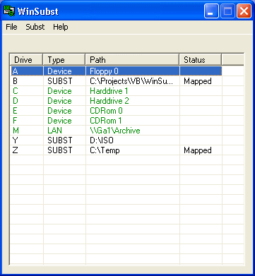



## WinSubst

### Description

GUI version of the subst DOS command. You can add, delete, start and stop subst'd drives. It does NOT use the subst DOS command.

Amendment: Windows NT, 2000 and XP only. May not work properly under Windows9x.
 
### More Info
 

             |
---                |---
**Submitted On**   |2003-06-21 09:41:26
**By**             |[John A Priestley](https://github.com/Planet-Source-Code/PSCIndex/blob/master/ByAuthor/john-a-priestley.md)
**Level**          |Advanced
**User Rating**    |5.0 (15 globes from 3 users)
**Compatibility**  |VB 6\.0
**Category**       |[Complete Applications](https://github.com/Planet-Source-Code/PSCIndex/blob/master/ByCategory/complete-applications__1-27.md)
**World**          |[Visual Basic](https://github.com/Planet-Source-Code/PSCIndex/blob/master/ByWorld/visual-basic.md)
**Archive File**   |[WinSubst1603866212003\.zip](https://github.com/Planet-Source-Code/john-a-priestley-winsubst__1-46338/archive/master.zip)

